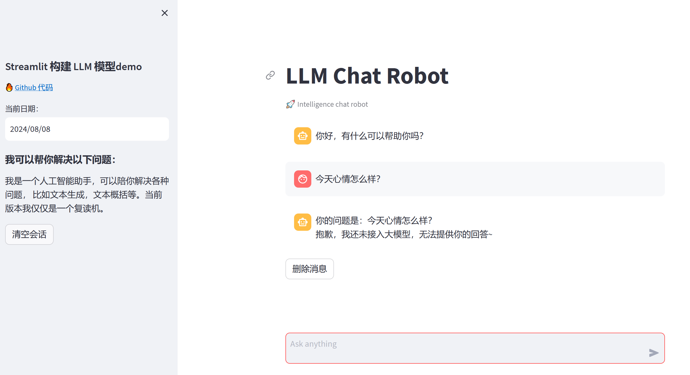

## streamlit搭建LLM交互应用

### 项目介绍

#### 就是为了玩，别无其他

### 开发环境

* Python版本为V3.8+
* streamlit版本为1.24.0

### 搭建虚拟环境

* conda create -n streamlit_env  python==3.8.18
* conda activate streamlit_env
* pip install -r requirements.txt

### 本地运行

* 下载代码
    git clone <https://github.com/hgsw/streamlit.git>
* 启动服务
    cd streamlit && streamlit run streamlit_app.py --server.address 127.0.0.1 --server.port 6006
* 浏览器访问前端地址
    <http://127.0.0.1:6006>

### 界面截图

